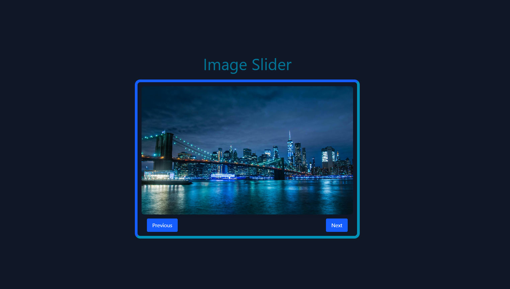

# 📸 React Image Slider

This project is a **React-based Image Slider** built using functional components, hooks, and Tailwind CSS for styling. It showcases a series of images with smooth transitions and supports both manual and automatic slide navigation.


## 🚀 Live Preview 👉 [View Live](https://image-slider-alpha-seven.vercel.app/)

## 🚀 Features

* 🔁 Auto-play every 2 seconds
* 🖱️ Pause on hover
* ⬅️➡️ Manual previous/next controls
* 🌄 Responsive image display with animation
* 🎨 Styled with Tailwind CSS


## 🛠️ Technologies Used

* **React.js** (Functional Components + Hooks)
* **Tailwind CSS** for modern, responsive styling
* **useEffect**, **useState**, and **useRef** hooks


## 📂 Folder Structure

```
src/
├── App.js           # Main React component
├── assets/          # Image files (img1.jpg to img9.jpg)
└── index.css        # Tailwind base styles
```


## 🧠 What I Learned

> Building this project helped me understand:

* ✅ How to create a simple but powerful image slider in React
* ✅ The use of `useState` for handling current slide index
* ✅ How `useEffect` is used to manage side effects like intervals
* ✅ `useRef` to store interval timer reference
* ✅ Managing hover state to pause/resume autoplay
* ✅ Dynamic class toggling for animations (`opacity-100`, `opacity-0`)
* ✅ Creating responsive layouts with Tailwind CSS


## 🧑‍💻 How to Run This Project

1. Clone this repo:

```bash
git clone https://github.com/your-username/react-image-slider.git
```

2. Navigate to project folder:

```bash
cd react-image-slider
```

3. Install dependencies:

```bash
npm install
```

4. Start the development server:

```bash
npm run dev  # or npm start
```

Make sure images (`img1.jpg` to `img9.jpg`) are placed inside `src/assets/`.

---

# Screenshot



## 🙌 Acknowledgements

* Built using **React** with ❤️
